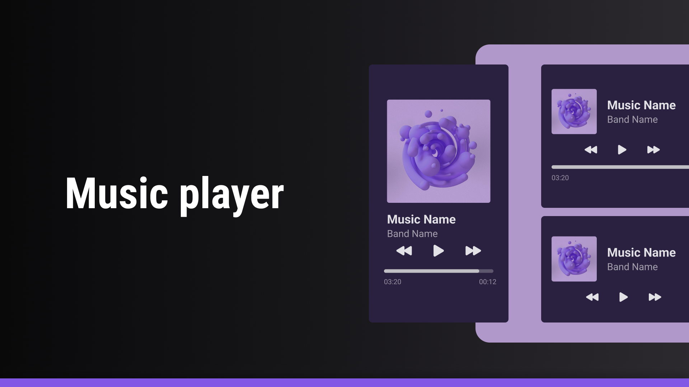

<h1 align="center"> Mini music player </h1>

Mini project to reinforce and practice HTML and CSS concepts

  <a href="#-Technologies">Technologies</a>&nbsp;&nbsp;&nbsp;|&nbsp;&nbsp;&nbsp;
  <a href="#-projeto">Project</a>&nbsp;&nbsp;&nbsp;|&nbsp;&nbsp;&nbsp;
  <a href="#-layout">Layout</a>

 

  

## 🚀 Technologies

This project was developed with the following technologies:

## 💻 Project

The music player is a component for playing audio. It can be used in web or mobile applications.

## 🔖 Layout

You can view the project layout through [FROM THIS LINK](https://www.figma.com/design/mCWBO14XMJZ8U2AaJBIXrh/Player-de-M%C3%BAsica-%E2%80%A2-Desafio-01--Community-?node-id=1-133&t=sWrEGfuvXk4F8B0Y-1). It is necessary to have an account on
 [Figma](https://figma.com) to access it.

---

Made by : [Augusto Valerio](https://github.com/Augusto-Valerio).
